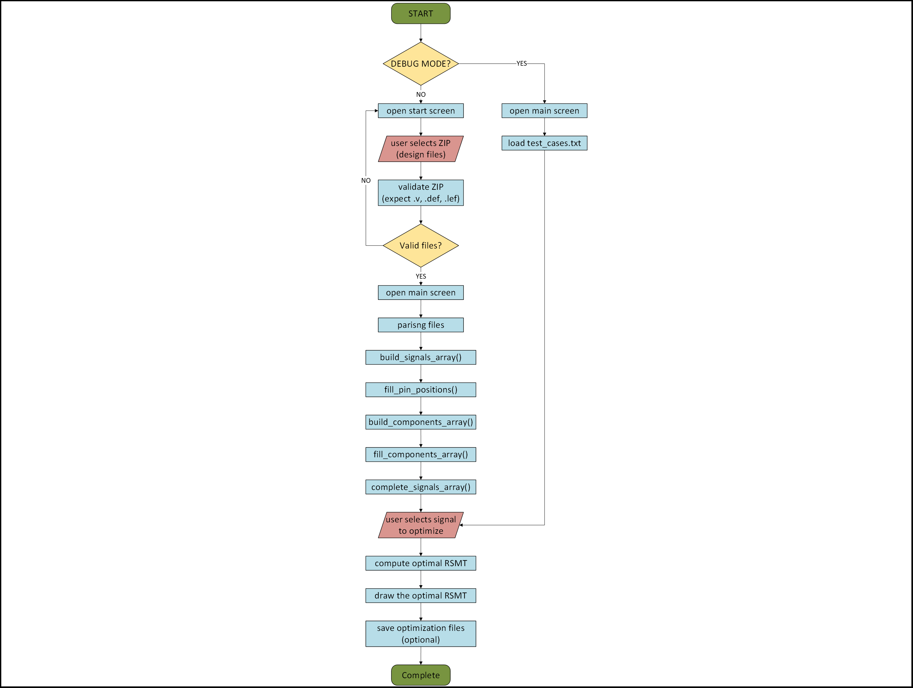

# VLSI Routing Optimizer Tool


## Overview

`VLSI_Routing_Optimizer_Tool` is a Python-based graphical tool for routing optimization in VLSI designs.


## Features

- Full GUI built with Tkinter
- Parses standard DEF, LEF, and Verilog input files
- Optimizes each net using dynamic programming and GeoSteiner
- Visualizes Steiner trees graphically
- Outputs optimization results in JSON and PNG formats
- Debug mode for internal testing

## Directory Structure

```
VLSI_Routing_Optimizer_Tool/
├── src/
│   ├── main.py            # GUI + integration
│   ├── FDP.py             # Full-set dynamic programming algorithm
│   └── validate.sh        # Standalone RSMT checker
├── Input_Files/           # Input ZIPs (DEF+LEF+Verilog)
├── Output_Files/          # Output results (JSON + PNG)
├── tests/                 # Manual test cases (in DEBUG mode)
└── geosteiner-5.3/        # GeoSteiner compiled library
```

## Installation

**Requirements:** Ubuntu Linux, Python 3.10+, gcc, make

```bash
sudo apt update
sudo apt install build-essential libtool python3.10 python3-tk
```

**GeoSteiner Installation:**

```bash
tar -xf geosteiner-5.3.tar
cd geosteiner-5.3
./configure CFLAGS="-fPIC"
make -j$(nproc)
cd .libs
gcc -shared -o libgeosteiner.so *.o ../lp_solve_2.3/*.o -lm
cp libgeosteiner.so ..
```

Export the library path:

```bash
export LD_LIBRARY_PATH=$LD_LIBRARY_PATH:$(pwd)/..
```

## Running the Tool

```bash
cd src/
python3.10 main.py             # Standard mode
python3.10 main.py -D          # Debug mode (uses test_cases.txt)
```

## Input Format

Place ZIP files containing the following into `Input_Files/`:

- `design.v`     : Netlist in Verilog format
- `design.def`   : Component placement
- `design.lef`   : Standard cell info

## Output

Each signal optimization creates:

- A PNG image of the Steiner Tree
- A JSON file with detailed geometry & length
- A log file with runtime and debug info

Example JSON output:

```json
{
  "terminals": [[0, 0], [0, 10], [5, 5]],
  "length": 15.0,
  "steiner_points": [[0.0, 5.0]],
  "edges": [[[0, 0], [0.0, 5.0]], [[0, 10], [0.0, 5.0]], [[5, 5], [0.0, 5.0]]]
}
```



## Credits

Developed as part of Project B at the VLSI Lab, Technion Faculty of Electrical & Computer Engineering.

**Contributors:**

- Eliram Amrusi
- Eliraz Kadosh

**Supervisor:**

- Amnon Stanislavsky

**Special thanks to:**

- GeoSteiner Project (v5.3): [https://www.geosteiner.com/](https://www.geosteiner.com/)

---

*For academic use only. Not intended for commercial applications.*

